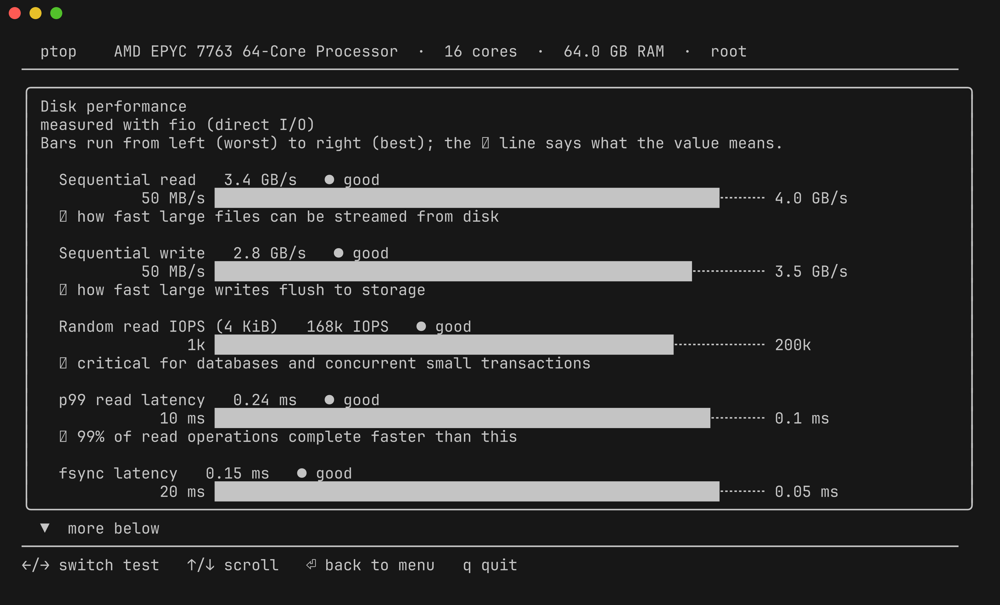
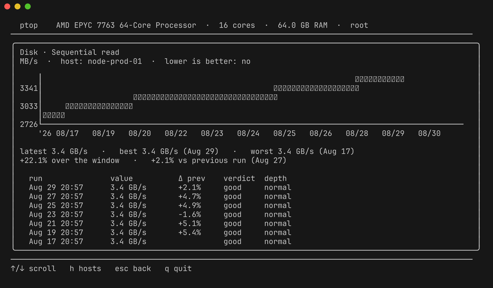
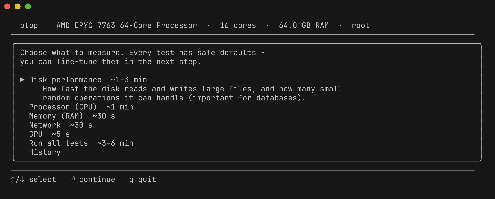
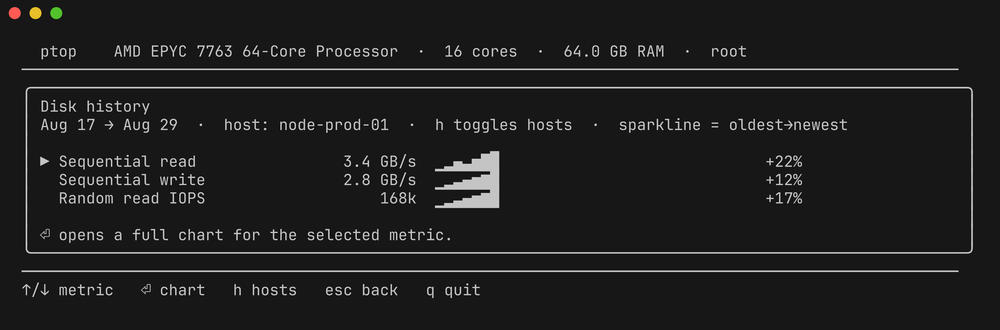

# ptop

[](https://github.com/alun-hub/ptop/releases/latest)
[](LICENSE)
[](https://goreportcard.com/report/github.com/alun-hub/ptop)

**ptop** is a guided performance benchmarking and diagnostics tool for Linux servers. It features a modern, `btop`-style terminal user interface (TUI) powered by Charm Bubble Tea and Lipgloss, accompanied by a scriptable CLI.

It runs disk, CPU, memory, network, and GPU tests with sensible defaults, translates raw benchmark numbers into plain-language interpretations with visual gauges, and automatically tracks your historical performance over time.

---

## Screenshots

| Benchmark Results & Verdicts | Historical Trend Chart (ntcharts) |
| :---: | :---: |
|  |  |

| Interactive Menu & Configuration | Area Overviews & Sparklines |
| :---: | :---: |
|  |  |

---

## Features

- **Guided & Plain-Language**: No cryptic benchmark output. Every metric includes an evaluation verdict (`● good`, `● ok`, `● low`), a horizontal visual gauge, and an explanation of what the measurement means in practice.
- **Run-to-Run History & Comparison**: Automatically saves test results to a local JSONL log. Results are compared against previous runs on the same machine (e.g. `+14% faster vs Aug 24`).
- **Interactive Trend Analytics**: Browse past runs by test area with compact sparklines and interactive Braille time-series line charts (`ntcharts`).
- **History Pruning**: Delete unwanted or outlier test runs with the <kbd>d</kbd> key in the TUI (with inline confirmation) or `ptop history rm <#>` from the CLI.
- **Smart Engine Fallbacks**: Prefers industry-standard tools (`fio`, `sysbench`, `iperf3`, `nvidia-smi`), but falls back gracefully to high-performance built-in implementations so it works immediately on bare servers.
- **Zero-Dependency Static Binary**: Builds to a single standalone binary with zero external runtime dependencies.
- **Non-Interactive CLI**: Run benchmarks from scripts or over SSH without a TTY (`ptop run all`, `ptop history cpu`).
- **Built-in Throughput Server**: Includes `ptop serve` to measure network bandwidth between two servers without needing to set up `iperf3`.
- **Machine Inventory & Tuning Advice**: `ptop info` prints a privilege-free snapshot of the host — CPU model, cores, scaling governor and CPU features, RAM/swap, transparent huge pages, NUMA nodes, whole-disk devices (HDD/SSD, I/O scheduler), NICs, and detected virtualization or cloud provider — followed by plain-language recommendations (governor, `vm.swappiness`, THP, I/O scheduler, missing benchmark tools, …) with the exact command to apply each. A condensed version appears in the interactive menu.
- **System Man Page**: Ships with a complete manual page (`man ptop`).

---

## Installation

### Pre-built Packages (.deb & .rpm)

Download pre-built `.deb`, `.rpm`, or `.tar.gz` packages for `amd64` and `arm64` from the [Latest Release](https://github.com/alun-hub/ptop/releases/latest):

```sh
# Debian / Ubuntu
sudo dpkg -i ptop_*_linux_amd64.deb

# Fedora / RHEL / openSUSE / Rocky Linux
sudo rpm -i ptop_*_linux_amd64.rpm
```

### Standalone Binary

```sh
# Download and extract the latest tarball
tar -xzf ptop_*_linux_amd64.tar.gz
sudo mv ptop /usr/local/bin/
```

### Build from Source

Requirements: Go 1.21+

```sh
git clone https://github.com/alun-hub/ptop.git
cd ptop
go build -o bin/ptop .
```

---

## Usage

### Interactive TUI

Launch the full-screen terminal interface:

```sh
ptop
```

#### Keyboard Shortcuts

| Key | Action |
| --- | --- |
| <kbd>↑</kbd> / <kbd>↓</kbd> or <kbd>k</kbd> / <kbd>j</kbd> | Move cursor / select menu item / navigate fields / scroll |
| <kbd>←</kbd> / <kbd>→</kbd> or <kbd>h</kbd> / <kbd>l</kbd> | Adjust settings (depth, target) / switch result tabs / toggle host filter |
| <kbd>Enter</kbd> | Open selection / start test / focus text input / view metric chart |
| <kbd>t</kbd> | Edit tag / label for highlighted benchmark run |
| <kbd>Space</kbd> / <kbd>c</kbd> | Set / toggle diff baseline run, or open diff comparison view |
| <kbd>d</kbd> | **Delete** highlighted benchmark run (in History list or detail view) |
| <kbd>y</kbd> / <kbd>n</kbd> | Confirm (<kbd>y</kbd>) or cancel (<kbd>n</kbd>/<kbd>Esc</kbd>) run deletion |
| <kbd>PgUp</kbd> / <kbd>PgDn</kbd> | Fast scroll results and history tables |
| <kbd>Esc</kbd> | Go back to previous screen / cancel deletion prompt / cancel test |
| <kbd>q</kbd> / <kbd>Ctrl+C</kbd> | Quit application |

---

### Non-Interactive CLI

Run tests directly in scripts, CI pipelines, or headless SSH sessions:

```sh
# Run individual test suites
ptop run disk --path /mnt/storage --depth deep
ptop run cpu --depth normal
ptop run mem
ptop run net --host 192.168.1.10
ptop run gpu

# Run all test suites in sequence
ptop run all

# Start network throughput server on peer host
ptop serve
ptop serve :9000

# Show a snapshot of this machine (CPU, memory, disks, NICs, cloud/virt)
ptop info
```

#### CLI Flags for `ptop run`:

- `--depth <quick|normal|deep>`: Test duration and thoroughness:
  - `quick`: ~10s per sub-test (rapid check)
  - `normal`: ~30s per sub-test (default)
  - `deep`: ~60s per sub-test (stress check & thermal throttling)
- `--tag <text>`: Tag or label for this benchmark run (stored in history).
- `--path <dir>`: Target directory for disk I/O benchmarks (default: current directory).
- `--host <ip|host>`: Peer server running `ptop serve`, `iperf3 -s`, or accessible via SSH.
- `--url <url>`: Custom download URL for network throughput measurement.
- `--port <port>`: Port of `ptop serve` on remote host (default: `5330`).

---

## History & Trend Tracking

Every benchmark run is automatically recorded in `$XDG_DATA_HOME/ptop/history.jsonl` (defaults to `~/.local/share/ptop/history.jsonl`).

```sh
# List all recorded runs
ptop history

# Inspect a specific run with deltas vs previous run
ptop history 1

# Compare two runs side-by-side
ptop history diff 1 2

# Set or update a tag/label for a run
ptop history tag 1 "baseline after kernel upgrade"

# View metric trends and sparklines for a test area
ptop history cpu
ptop history disk
ptop history net all    # include metrics from all recorded hosts

# View complete run-by-run history for a single metric
ptop history cpu "single-threaded"
ptop history disk "random read"

# Delete a benchmark run from history
ptop history rm 3
ptop history rm 20260831T192659
```

---

## Benchmark Suites & Metrics

| Suite | Preferred Tool | Fallback Tool | Measured Metrics |
| :--- | :--- | :--- | :--- |
| **Disk** | `fio` | `dd` (`O_DIRECT`) | Sequential read/write throughput, 4 KiB random IOPS, p99 read latency, commit latency (fsync), small file creation/stat/deletion rate, database transactions (SQLite ACID ops/s). |
| **CPU** | `sysbench` | Built-in prime test | Single-core & multi-core ops/s, SMT core scaling, AES-256-GCM encryption throughput, Deflate compression rate, process fork+exec rate, hypervisor steal time, context switch latency, thermal throttling. |
| **Memory** | `sysbench` | Built-in memory copy | Write bandwidth, random-access latency (pointer chasing), free RAM, NUMA node topology. |
| **Network** | `ptop serve` / `iperf3` / SSH | Public HTTP CDN | Latency, jitter, packet loss, DNS resolution, TCP+TLS handshake; LAN gateway latency, link speed/duplex, NIC errors, flood-ping throughput estimate (root); download/upload throughput. |
| **GPU** | `nvidia-smi` | DRM sysfs (`/sys/class/drm`) | GPU hardware model, VRAM capacity/usage, load percentage, temperature, OpenGL score (`glmark2` when present). |

> **Tip:** For maximum measurement precision on server environments, install `fio`, `sysbench`, and `iperf3` (`sudo apt install fio sysbench iperf3` or `sudo dnf install fio sysbench iperf3`) and run `ptop` as root to bypass RAM caching on direct disk reads.

---

## Manual Page

A comprehensive UNIX manual page is included:

```sh
man ptop
# or preview directly from repo:
man -l man/ptop.1
```

---

## Project Structure

```
ptop/
├── main.go            - Application entry point & CLI subcommand routing
├── cli.go             - Non-interactive CLI runners (ptop run, ptop history)
├── cli_test.go        - CLI command & argument unit tests
├── man/
│   └── ptop.1         - UNIX roff/mandoc manual page
├── internal/
│   ├── bench/         - Benchmark execution engine & tool drivers
│   │   ├── disk.go    - Storage I/O tests (fio / dd)
│   │   ├── meta.go    - Small file metadata tests (create / stat / delete)
│   │   ├── sqlite.go  - Database ACID transaction tests (SQLite WAL)
│   │   ├── cpu.go     - CPU compute, scaling & crypto tests (sysbench / built-in)
│   │   ├── mem.go     - Memory bandwidth & latency tests
│   │   ├── net.go     - Network latency & throughput tests
│   │   ├── lan.go     - Local link, gateway & NIC error diagnostics
│   │   ├── gpu.go     - GPU detection, VRAM & thermal sensors
│   │   └── serve.go   - Lightweight built-in throughput server (ptop serve)
│   ├── history/       - JSONL history storage, session grouping, series, deltas & diffs
│   │   ├── history.go - History storage, tag updates and session management
│   │   ├── series.go  - Metric series grouping, statistics and sparklines
│   │   └── diff.go    - Side-by-side run comparison engine
│   └── ui/            - Bubble Tea TUI models, view renderers, and Lipgloss theme
└── assets/            - Documentation screenshots and preview assets
```

---

## License

MIT License. See [LICENSE](LICENSE) for details.
